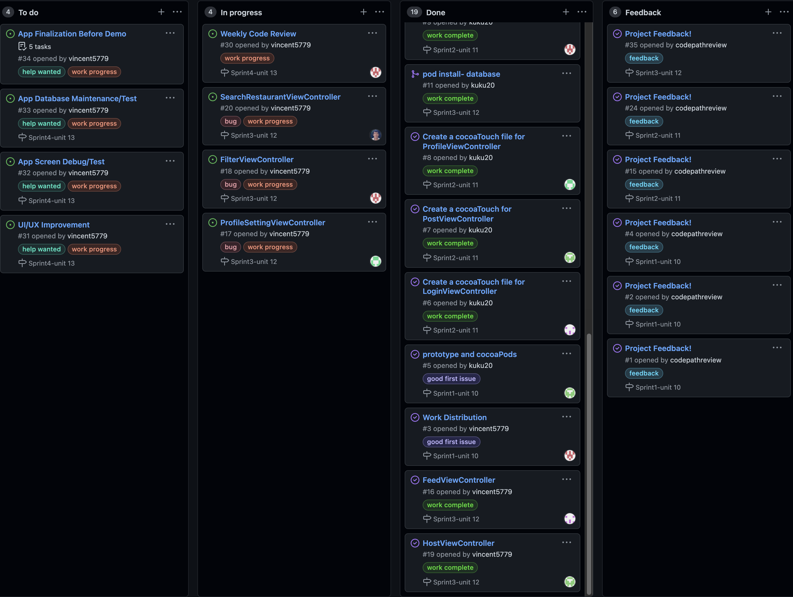
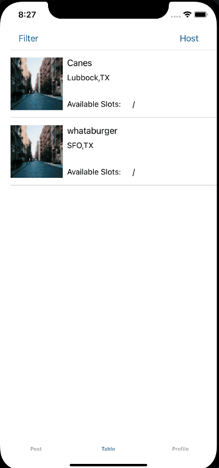
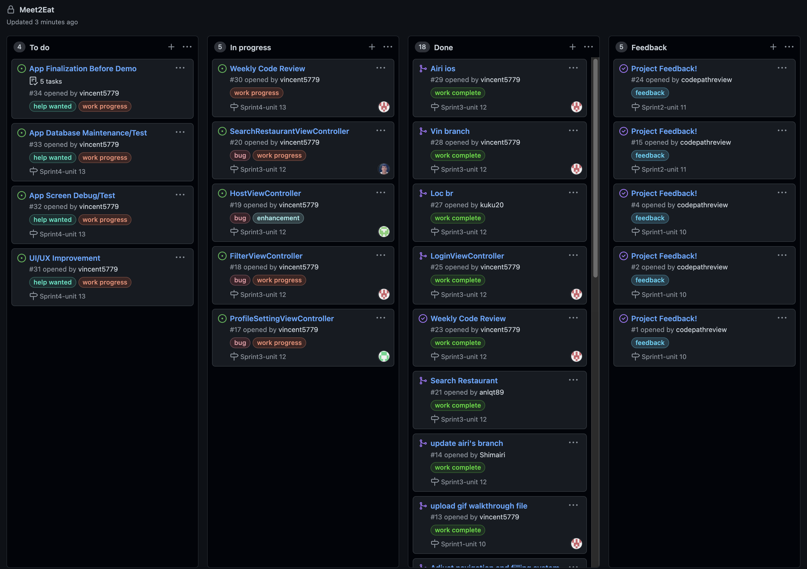
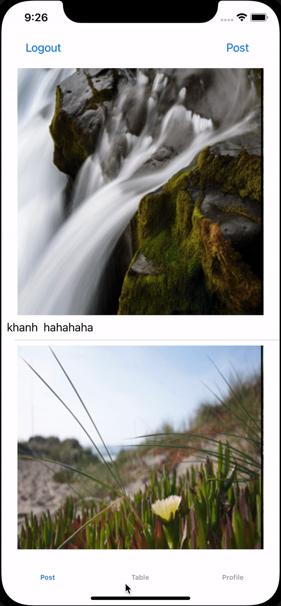
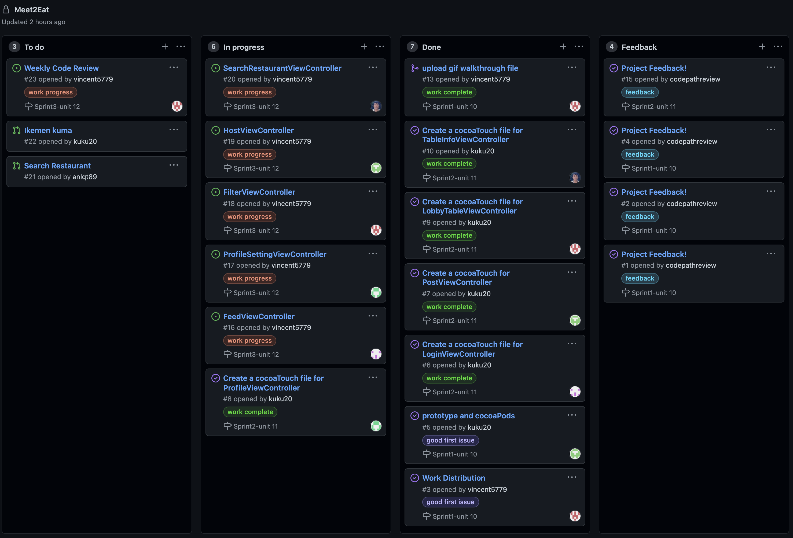
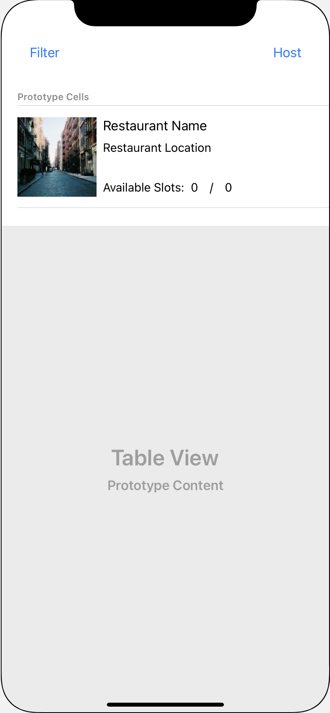
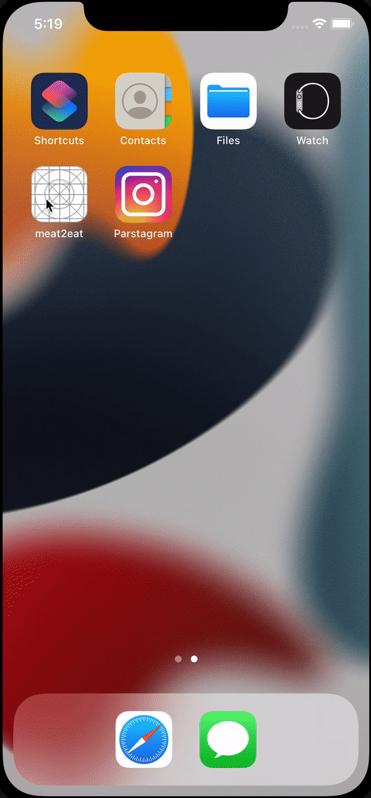
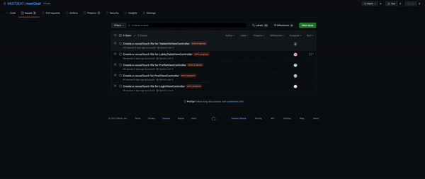

# Meet2Eat

## Table of Contents
1. [Work Distribution](#Work-Distribution)
2. [Demo Section](#Demo-Section)
3. [Overview](#Overview)
4. [Product Spec](#Product-Spec)
5. [Wireframes](#Wireframes)
6. [Schema](#Schema)
7. [Weekly User Story Check-off](#Weekly-User-Story-Check-off)

## Work Distribution
* Khanh Ho: LoginViewController, FeedViewController
* Airi Shimamura: ProfileViewController, ProfileSettingViewController
* KuoHuang Vincent Hew: LobbyViewController, FilterViewController
* Loc Luu: PostViewController, HostViewController
* An Lam: TableInfoViewController, SearchRestaurantViewController

## Demo Section
### Pitch PDF
[Local Demo Pitch Slide](demoPitch.pdf)

### App Walkthrough


### Demo Build Environment and Requirement
The Current Version is designed for Iphone 11 simulator iOS 15. Auto layout is already included in the design; however, Meet2Eat is still under development, and there are still testing, debugging, and bug fixing needed for different devices. Please build and run on Iphone 11 simulator til future update.


### Contact Info
* Vincent Hew
  </br>Email: vncent5779@gmail.com
  
## Overview
### Description
Meet2Eat is an iOS app that connects people through thoughtful conversations during meals. By giving away discounts to our users to encourage them connecting to different people and experiencing a different perspective of the world and community. Meet2Eat: a place for good food and good company to gather around.


## Product Spec

### 1. User Stories (Required and Optional)

**Required Must-have Stories**
* User logs in to use the app.
* User can post the image and give other user's image comment.
* User can join, withdraw, cancel, or create table.
* User can see the list of tables.
* User can see the table details.
* User can check their personal information in profile page.

**Optional Nice-to-have Stories**

* Users can filter the table list based on their interest tag.
* Users can filter the capacity count of the table.
* Users can change their username, password, and interest tags through profile setting page.
* User's profile icon will be displayed next to their comment and caption.

### 2. Screen Archetypes

* Launch screen
   * App logo "MEET2EAT"
* Login/Signup screen
   * User can log in or sign up
* Post screen
   * User can view all the posts from all the app users
   * User can post a photo and add caption
   * User can comment a post
 * Host screen
   * User can host a table
   * User can choose filter based on their interests and capacity for the table 
 * Profile screen
   * User can view and edit their profile
### 3. Navigation

**Tab Navigation** (Tab to Screen)

* Post
* Table
* Profile

**Flow Navigation** (Screen to Screen)

* LoginViewController
   * FeedTableViewController
* FeedTableViewController
   * LoginViewController
   * PostViewController
* PostViewController
   * FeedTableViewController
* LobbyTableViewController
   * HostViewController
   * FilterViewController
   * TableInfoViewController
* FilterViewController
   * LobbyTableViewController
* HostViewController
   * LobbyTableViewController
   * SearchRestaurantTableViewController
* TableInfoViewController
   * LobbyTableViewController
* ProfileViewController
   * ProfileSettingViewController
* ProfileSettingViewController
   * ProfileViewController

## Wireframes
<br>


### [BONUS] Digital Wireframes & Mockups

<br>

### [BONUS] Interactive Prototype


## Schema 
1. POSTS
2. User
3. Comments
4. Table2Meet


### Models
#### POSTS
| Property      | Type     | Description |
| ------------- | -------- | ------------|
| objectId      | String   | unique id for the user post(default field) |
| createdAt     | DateTime | date when post is created (default field) |
| ACL           | ACL      | rw permission (default field) |
| updatedAt     | DateTime | date when post is last updated (default field) |
| image         | File     | image that user posts |
| caption       | String   | image caption by user |
| author        | Pointer to User| the user of the post |
| comments      | Array| coletion of Pointer to User with their comment |


#### User
| Property      | Type     | Description |
| ------------- | -------- | ------------|
| objectId      | String   | unique id for the user post(default field) |
| createdAt     | DateTime | date when post is created (default field) |
| updatedAt     | DateTime | date when post is last updated (default field) |
| ACL           | ACL      | rw permission (default field) |
| username      | String | user update their name |
| image         | File  | image that user icon |
| password      | String| password for user|
| email         | String | user email|


#### Comments
| Property      | Type     | Description |
| ------------- | -------- | ------------|
| objectId      | String   | registered as table id (default field) |
| createdAt     | DateTime | date when the table is created (default field) |
| updatedAt     | DateTime | date when the table is updated (default field) |
| ACL           | ACL      | rw permission (default field) |
| text          | String   | store comments|
| post          | Pointer to Posts| the post objectID |
| author        | Pointer to User| the user objectID |


#### Table2Meet
| Property      | Type     | Description |
| ------------- | -------- | ------------|
| objectId      | String   | registered as table id (default field) |
| createdAt     | DateTime | date when the table is created (default field) |
| updatedAt     | DateTime | date when the table is updated (default field) |
| ACL           | ACL      | rw permission (default field) |
| host          | Pointer to User | the host of the table |
| ResName       | String   | the name of the restaurant where to open tb |
| location      | object(string)  | The street of the location address of the table location = {street, state, city, country, zipcode} |
| slots         | Integer  | maximum number of people can participate to the table |
| guestsId      | Array Pointers to User | the participants of the table including host and guests |
| detailMeet    | String   | description for table |


### Networking
- Post Screen
    - (Read/GET) Query all posts where user is author
         ```swift
         let query = PFQuery(className:"Post")
         query.whereKey("author", equalTo: currentUser)
         query.order(byDescending: "createdAt")
         query.findObjectsInBackground { (posts: [PFObject]?, error: Error?) in
            if let error = error { 
               print(error.localizedDescription)
            } else if let posts = posts {
               print("Successfully retrieved \(posts.count) posts.")
           // TODO: Do something with posts...
            }
         }
         ```
    - (Create/POST) Create a new like on a post
        ```swift
        var parseObject = PFObject(className:"Post")
        
        parseObject["objectId"] = "default"
        parseObject["user"] = "user's image post"
        parseObject["image"] = "url/.pnj"
        parseObject["caption"] = "String"
        parseObject["commentsCount"] = "number"
        parseObject["likesCount"] = "number"

        // Saves the new object.
        parseObject.saveInBackground {
          (success: Bool, error: Error?) in
          if (success) {
            // The object has been saved.
          } else {
            // There was a problem, check error.description
          }
        }
        ```

    - (Delete) Delete existing like
        ```swift
            var deleteAttributesOnly = true
            var query = PFQuery(className:"Post")

            query.getObjectInBackgroundWithId("<PARSE_OBJECT_ID>") {
              (parseObject: PFObject?, error: NSError?) -> Void in
              if error != nil {
                print(error)
              } else if parseObject != nil {
                if deleteAttributesOnly {
                    parseObject["likesCount"] = "number"
                    parseObject.saveInBackground()
                } else {
                      parseObject.deleteInBackground()
                }
              }
            }
        ```
    - (Create/POST) Create a new comment on a post
    - (Delete) Delete existing comment
        ```swift
            var deleteAttributesOnly = true
            var query = PFQuery(className:"Post")

            query.getObjectInBackgroundWithId("<PARSE_OBJECT_ID>") {
              (parseObject: PFObject?, error: NSError?) -> Void in
              if error != nil {
                print(error)
              } else if parseObject != nil {
                if deleteAttributesOnly {
                    parseObject["comment"] = "String"
                    parseObject.saveInBackground()
                } else {
                      parseObject.deleteInBackground()
                }
              }
            }
        ```
- Create Post Screen
    - (Create/POST) Create a new post object
- Profile Screen
    - (Read/GET) Query logged in user object
    - (Update/PUT) Update user profile image
- Table Screen
    - (Read/GET) Query all table information
    - (Delete) Delete existing table
- Create Table Screen
    - (Create/POST) Create a table for host and users


## Weekly User Story Check-off
### Unit 13
- [x] Updated status of issues in Project board. (2pts)
- [x] Sprint planned for next week (Issues created, assigned & added to project board). (3pts)
- [x] Completed user stories checked-off in README. (2pts)
- [x] Gifs created to show build progress and added to README. (3pts)

#### Build Progress Walkthrough

Host

Table Info

Pull to refresh feature

Infinite scrolling feature


### Unit 12
- [x] Updated status of issues in Project board. (2pts)
- [x] Sprint planned for next week (Issues created, assigned & added to project board). (3pts)
- [x] Completed user stories checked-off in README. (2pts)
- [x] Gifs created to show build progress and added to README. (3pts)

#### Build Progress Walkthrough





### Unit 11
- [x] Updated status of issues in Project board. (2pts)
- [x] Sprint planned for next week (Issues created, assigned & added to project board). (3pts)
- [x] Completed user stories checked-off in README. (2pts)
- [x] Gifs created to show build progress and added to README. (3pts)

#### Build Progress Walkthrough






### Unit 10
- [x] Work distribution for each team member.
- [x] Project prototype.
- [x] Install CocoaPod.
- [x] Updated status of issues in Project board. (2pts)
- [x] Sprint planned for next week (Issues created, assigned & added to project board). (3pts)
- [x] Completed user stories checked-off in README. (2pts)
- [x] Gifs created to show build progress and added to README. (3pts)

#### Build Progress Walkthrough




